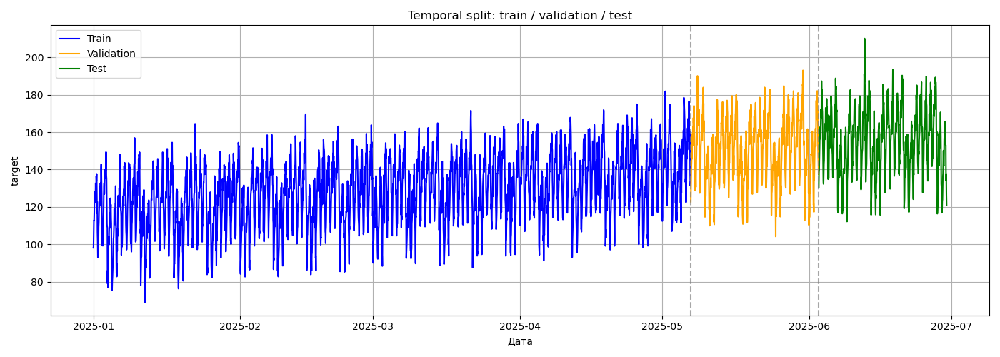
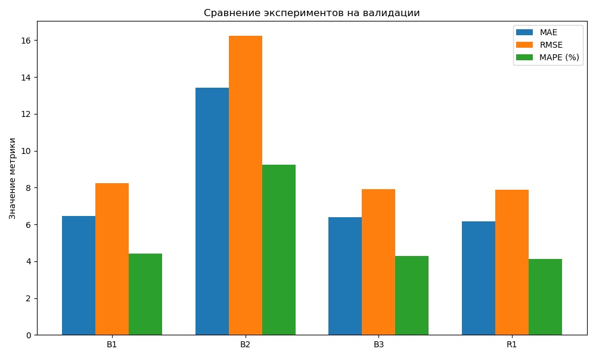
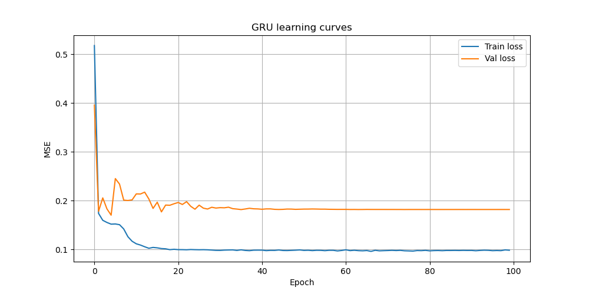
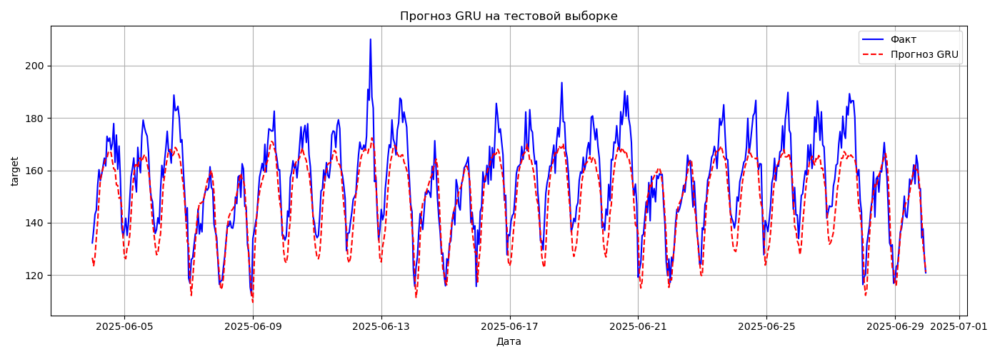

# HW12 – Временные ряды: прогнозирование, корректная валидация, GRU

## 1. Кратко: что сделано
- Загружен датасет `S12-hw-dataset.csv` с часовыми наблюдениями.
- Проведён первичный анализ, выполнен корректный **temporal split**.
- Построены лаговые признаки и скользящие статистики.
- Обучены базовые модели (Baselines) и рекуррентная нейросеть GRU.
- Все результаты зафиксированы в логах и артефактах.

## 2. Среда и воспроизводимость
- **Python**: 3.9, pandas, numpy, scikit-learn, torch
- **Seed**: 42
- **Результаты экспериментов**: [artifacts/runs.csv](artifacts/runs.csv)

## 3. Данные и валидация
- **Датасет**: `S12-hw-dataset.csv`
- **Размер**: 4320 записей (180 дней * 24 часа).
- **Разделение (Temporal Split)**: 
    - Train (70%), Validation (15%), Test (15%).
    - 

### Почему Random Split некорректен?
Для временных рядов использование `random split` (случайное перемешивание) недопустимо, так как это нарушает хронологическую зависимость данных. При случайном разбиении данные из будущего могут попасть в обучающую выборку («подглядывание»), что позволяет модели просто запомнить значения вместо обучения реальным закономерностям. Это приводит к получению неадекватно высоких метрик на валидации, которые невозможно воспроизвести в реальности.

### Обсуждение возможных утечек данных (Data Leakage)
Утечка данных возникает, когда информация, которая не должна быть доступна в момент прогноза, попадает в модель. В работе приняты меры против следующих утечек:
1. **Масштабирование**: `StandardScaler` обучается (fit) только на Train-выборке.
2. **Признаки**: Лаги и скользящие статистики вычисляются строго по прошлым значениям относительно текущего момента.
3. **Валидация**: Разделение данных выполнено строго по времени, чтобы модель всегда тестировалась на данных, идущих после обучающего периода.

## 4. Модели и эксперименты
Результаты экспериментов сведены в таблицу [runs.csv](artifacts/runs.csv).

| ID | Модель | Описание (Model Summary) | Dataset | Split |
|:---|:---|:---|:---|:---|
| **B1** | Naive | naive baseline (last value) | S12-hw-dataset.csv | temporal split |
| **B2** | Moving Average | moving average (window=24) | S12-hw-dataset.csv | temporal split |
| **B3** | Ridge | Ridge regression with lags | S12-hw-dataset.csv | temporal split |
| **R1** | GRU | 2-layers GRU (hidden=64) | S12-hw-dataset.csv | temporal split |

## 5. Лучшая модель (R1 - GRU)
Лучшие результаты показала модель GRU, которая эффективнее учитывает долгосрочные зависимости.
- **Архитектура**: [artifacts/best_gru_config.json](artifacts/best_gru_config.json)
- **Веса модели**: [artifacts/best_gru.pt](artifacts/best_gru.pt)
- **Процесс обучения**: 

### Финальный результат на тесте
Модель успешно улавливает суточную сезонность и тренд.

---

### Полный список артефактов
- [Таблица всех запусков (runs.csv)](artifacts/runs.csv)
- [Веса лучшей модели (best_gru.pt)](artifacts/best_gru.pt)
- [Конфигурация модели (best_gru_config.json)](artifacts/best_gru_config.json)
- [График разделения выборки](artifacts/figures/series_split.png)
- [Сравнение метрик бейзлайнов](artifacts/figures/baselines_compare.png)
- [Графики потерь обучения](artifacts/figures/gru_learning_curves.png)
- [Визуализация прогноза на тесте](artifacts/figures/best_forecast_test.png)
